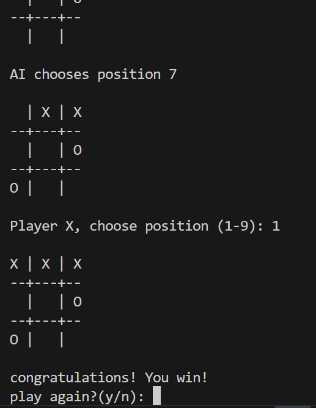

# tic-tac-toe-python
# 🤖 AI Tic Tac Toe

A simple Python-based Tic Tac Toe game where a player competes against an AI opponent.

 📌 About the Project
This is a command-line Tic Tac Toe game built using Python.  
The player plays against an AI that makes smart moves to either win or block t

 🎮 Features
- Human vs AI gameplay  
- AI blocks winning moves  
- Simple command-line interface  
- Easy and beginner-friendly logic  


 🛠️ Technologies Used
- Python 3  
- Basic AI logic (rule-based / simple decision-making)


 ▶️ How to Run

1. Clone the repository:
```bash id="clonecmd"
git clone https://github.com/mahrukh-ops/tic-tac-toe-python.git

2. Go to the project folder:
cd tic-tac-toe-python

3.Run the game:
python main.py

📸 Output



👩‍💻 Author
Mahrukh

