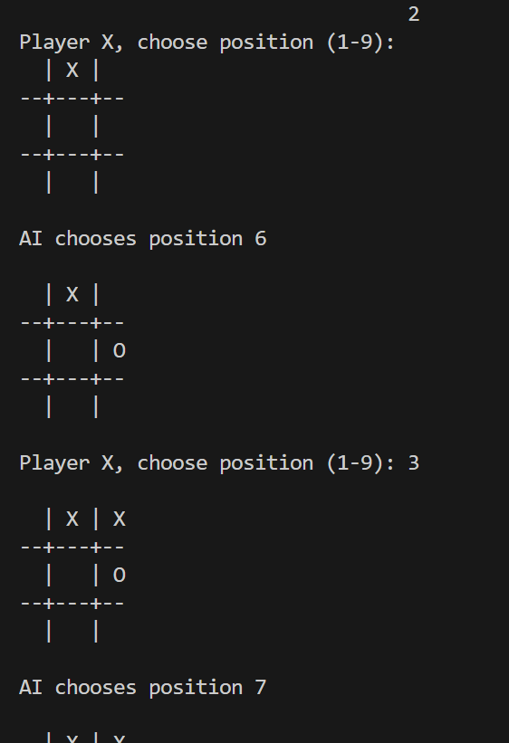

# 🤖 AI Tic Tac Toe

A Python-based Tic Tac Toe game where a human player competes against an AI opponent.

---

## 📌 About the Project

This project is a command-line Tic Tac Toe game built using Python. The player plays against an AI that makes moves automatically. The game checks for wins, losses, and draws, providing an interactive gaming experience.

---

## 🎮 Features

- Human vs AI gameplay
- Interactive command-line interface
- AI automatically selects moves
- Win, lose, and draw detection
- Beginner-friendly Python project

---

## 🛠️ Technologies Used

- Python 3
- Random Module
- Basic AI Logic

---

## 📂 Project Structure

```text
tic-tac-toe-python/
│
├── main.py
├── README.md
└── screenshots/
    ├── game_start.png
    └── game_end.png
```

---

## ▶️ How to Run

1. Clone the repository:

```bash
git clone https://github.com/mahrukh-ops/tic-tac-toe-python.git
```

2. Go to the project folder:

```bash
cd tic-tac-toe-python
```

3. Run the game:

```bash
python main.py
```

---

## 📸 Screenshots

### Game Start



### Game End


---

## 🎯 How to Play

1. Run the program.
2. Enter a position from 1 to 9.
3. The AI will make its move automatically.
4. Continue until there is a winner or a draw.

---

## 🤖 AI Logic

The AI:
- Selects available positions on the board.
- Attempts to make valid moves.
- Plays against the human player until the game ends.

---

## 📚 Concepts Used

- Lists
- Functions
- Loops
- Conditional Statements
- Random Module
- Game Logic

---

## 👩‍💻 Author

Mahrukh

